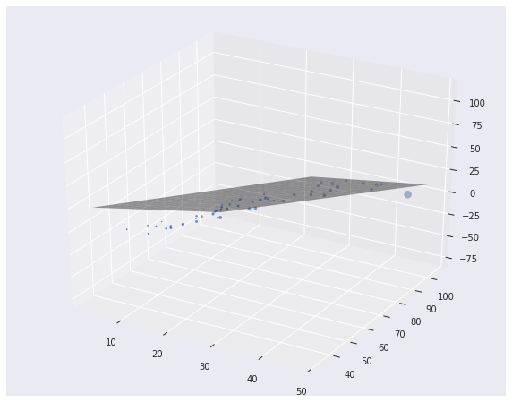

# Statistics-Scratch
<<<<<<< HEAD
implement statistical models from scratch

## Implementation

#### Basic
 1. simple binomial
 2. expected value
 3. chi-square
 4. metric study (mean, median, standard deviation, coviariance, correlation)

#### Linear Regression
 1. Least Square (1 feature, 2 features)

## Discussion

Will update overtime.

## Results

Linear regression 3D

=======
implement statistics models from scratch
>>>>>>> 7daa501812b948dbed0996b76bdada59293e301b
